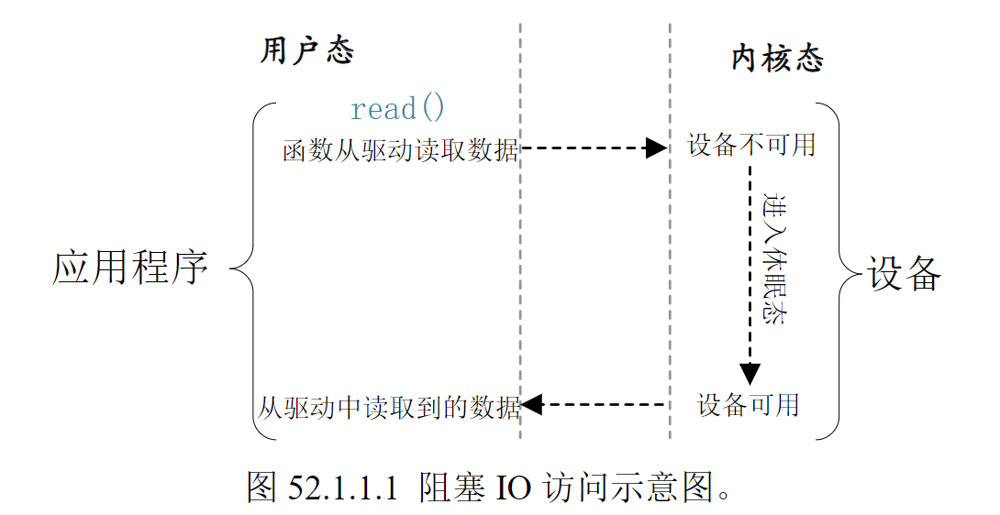
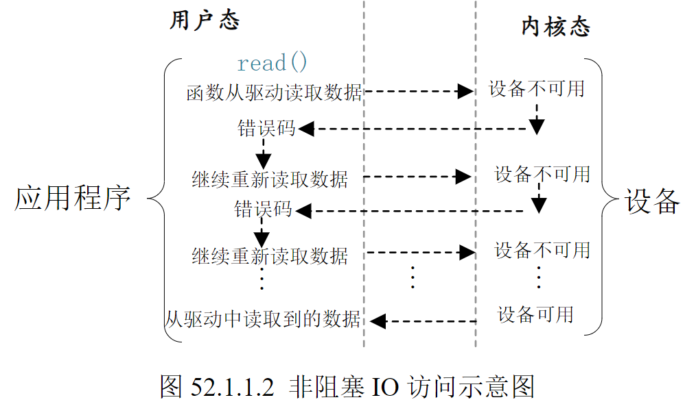

# 
 第五十二章 Linux 阻塞和非阻塞IO实验
> 阻塞和非阻塞 IO 是 Linux 驱动开发里面很常见的两种设备访问模式，在编写驱动的时候
一定要考虑到阻塞和非阻塞。本章我们就来学习一下阻塞和非阻塞 IO，以及如何在驱动程序中
处理阻塞与非阻塞，如何在驱动程序使用等待队列和 poll 机制。
---
# 52.1阻塞和非阻塞 IO
## 52.1.1 阻塞和非阻塞简介
这里的“IO”并不是我们学习 STM32 或者其他单片机的时候所说的“GPIO”(也就是引脚)。
这里的 IO 指的是 Input/Output，也就是输入/输出，是应用程序对驱动设备的输入/输出操作。当应用程序对设备驱动进行操作的时候，如果不能获取到设备资源，那么阻塞式 IO 就会将应用程
序对应的线程挂起，直到设备资源可以获取为止。对于非阻塞 IO，应用程序对应的线程不会挂
起，它要么一直轮询等待，直到设备资源可以使用，要么就直接放弃。阻塞式 IO 如图 52.1.1.1
所示：

----

